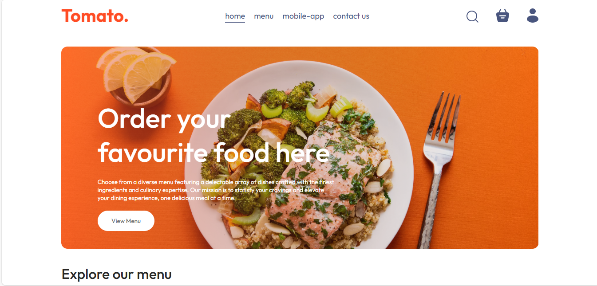
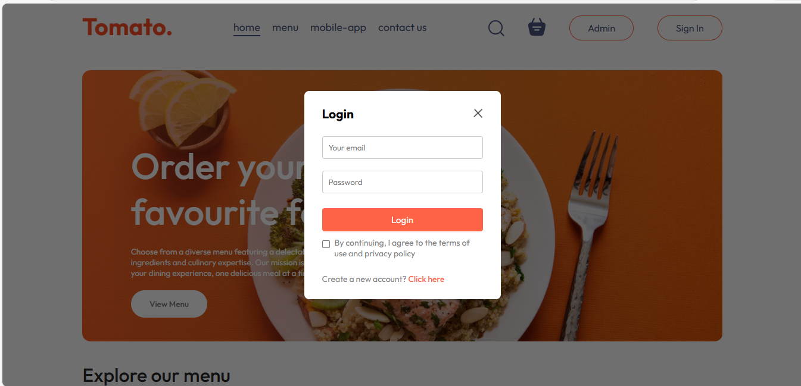
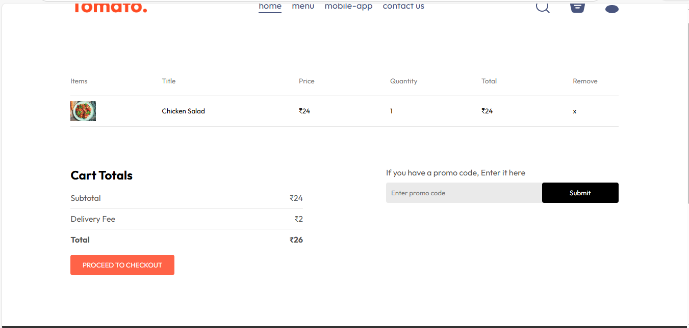
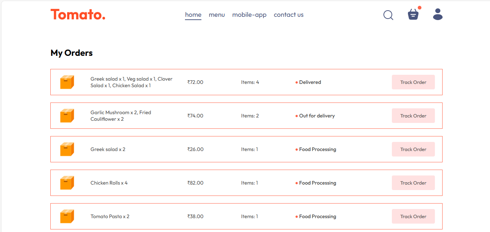
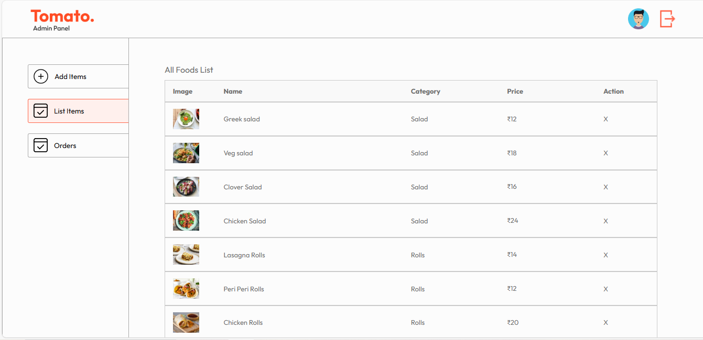

# 🍔 Food-Del — Food Delivery Website

## 📌 Project Overview

**Food-Del** is a full-stack food delivery web application designed to simulate a real-world online food ordering platform. The project is structured with three main modules: 
- 🖥️ **Frontend (User Interface)**
- 🛠️ **Backend (REST API Server)**
- 🧑‍💼 **Admin Panel (Management Dashboard)**

The platform allows users to browse available food items, explore categories, add items to their cart, and place orders seamlessly. It includes essential e-commerce functionalities such as dynamic cart updates, order total calculation, and user authentication.

The backend is responsible for managing product data, handling user accounts, processing orders, and interacting with the database using RESTful APIs. It ensures secure communication between the client and server while maintaining data consistency.

The admin panel enables administrators to efficiently manage the platform by:
- Adding new food items
- Updating existing products
- Deleting items
- Viewing and managing customer orders

This project helps users browse food items, place orders, and admins manage products & orders.
---

## 🌐 Live Demo

Frontend: [https://food-del-frontend-givz.onrender.com/](https://food-del-frontend-givz.onrender.com/)  
Backend: [https://food-del-backend-lc8g.onrender.com](https://food-del-backend-lc8g.onrender.com/)  
Admin: [https://food-del-admin-lzov.onrender.com](https://food-del-admin-lzov.onrender.com)

---

<!-- ## 📸 Screenshots

### 🏠 Home Page


### 🔐 Login Page


### 🛒 Cart Page


### 🧾 My Orders Page


### 🧑‍💼 Admin Dashboard


--- -->

## 📸 Screenshots

<table>
<tr>
<td width="50%">
<h4 align="center">🏠 Home Page</h4>

</td>
<td width="50%">
<h4 align="center">🔐 Login Page</h4>

</td>
</tr>

<tr>
<td width="50%">
<h4 align="center">🛒 Cart Page</h4>

</td>
<td width="50%">
<h4 align="center">🧾 My Orders</h4>

</td>
</tr>

<tr>
<td width="50%">
<h4 align="center">🧑‍💼 Admin Dashboard</h4>

</td>
<td width="50%">
</td>
</tr>
</table>

---

## 🛠️ Tech Stack

### 🖥️ Frontend (User)

- ⚛️ React (Vite)
- 🎨 Tailwind CSS
- 🔄 React Router DOM
- 🎯 React Icons
- 📦 Axios
- 🔔 React Toastify (toast notifications)

### 🛠️ Backend (Server)

- 🟢 Node.js
- 🚀 Express.js
- 🗃️ MongoDB (via Mongoose)
- 📤 Multer (file upload)
- 🔐 JWT Authentication 
- 🧂 bcrypt for password hashing 
- 📦 dotenv for environment configuration
- 🧪 CORS for logging and API support

### 🧑‍💼 Admin Panel

- ⚛️ React (Vite)
- 🎨 Tailwind CSS
- 🔄 React Router DOM
- 🎯 React Icons
- 📦 Axios
- 🔔 React Toastify

---

## 📁 Folder Structure

```
Food-Del/
├── frontend/               # Frontend (React + Vite)
│   ├── public/
│   ├── src/
|   |   ├── assets/         # Images, icons, etc.
│   │   ├── components/     # Reusable components (Navbar, FoodItem, etc.)
│   │   ├── pages/          # Page-level components (Home, Cart, Order)
|   |   ├── context/        # Global state management
│   │   ├── App.jsx         # Main app structure
│   │   └── main.jsx        # App entry point
│   ├── vite.config.js
│   └── package.json
│
├── backend/                # Backend (Node + Express)
│   ├── config/             # DB connection, environment setup
│   ├── controllers/        # Business logic
│   ├── models/             # Mongoose schemas (Food, User, Order, etc.)
│   ├── routes/             # Express routes (cart, users, etc.)
│   ├── middleware/         # Error handling, auth
│   ├── server.js           # Entry point
│   └── package.json
│
├── admin/                  # Admin Dashboard (React + Vite)
│   ├── public/
│   ├── src/
|   |   ├── assets/         # Images, icons, etc.
│   │   ├── components/     # Reusable components (Navbar, Sidebar, etc.)
│   │   ├── pages/          # Page-level components (Add item, List item, Order)
│   │   ├── App.jsx         # Main app structure
│   │   └── main.jsx        # App entry point
│   ├── vite.config.js
│   └── package.json
│
└── README.md

````
---

## 🚀 Getting Started

### Prerequisites

- Node.js 20.x
- MongoDB Atlas/local
- Git

---

## ⚙️ Installation & Setup

#### 1 Clone the repo

```bash
https://github.com/SC1709/Food-Del.git
cd Food-Del
````

### 🖥️ Frontend (Client)

```bash
cd frontend
npm install
npm run dev
````

### 🛠️ Backend (Server)

```bash
cd ../backend
npm install
# Create .env file (see below) and set the following:
npm start
```

### 🖥️ Admin Panel (Admin Access Only) 
⚠️ The Admin panel is accessible only to users with Admin user.
Users must be authenticated with a valid JWT token and authorized as admin to access protected routes.

```bash
cd ../admin
npm install
npm run dev
```

---

## 🔐 Environment Variables

Create a `.env` file in `backend/` directory:

```
PORT=5000
MONGO_URL=your_mongodb_connection_url
JWT_SECRET=your_jwt_secret
ADMIN_USERNAME=your_admin_user_name
ADMIN_PASSWORD=your_admin_user_password
```

---

## 🚀 Features

* 🏪 Product Listing & Detail View
* 🛍️ Dynamic Product Browsing
* 🛒 Add to Cart Functionality
* 🎨 Fully Responsive UI
* 🔐 User Authentication (JWT + bcrypt)
* 🧭 Client-Side Routing with React Router
* 📦 MongoDB Schema Design for Products,Orders,etc.
* 📦 Food Items Filters & Search
* 📡 REST API Integration with Express Backend   

---

## 🔮 Future Enhancements

* 📦 Product CRUD with Admin role
* 💳 Payment Gateway Razorpay/Stripe
* 🛍️ Order Tracking System (track orders, cancel, reorder)
* 📊 Sales Analytics Dashboard (for Admins)
* 📧 Email Notifications (order confirmation, account updates)
* 🔔 Push Notifications (real-time order updates, discounts)

---

### 📦 API Endpoints

> Current endpoints focus on products. Future updates will expand support to users, orders, authentication, and payments.

#### 🛍️ Product Routes

| Method | Endpoint              | Description                  | Access     |
|--------|-----------------------|------------------------------|------------|
| GET    | `/api/products`       | Fetch all products           | Public     |
| GET    | `/api/products/:id`   | Fetch product by ID          | Public     |
| POST   | `/api/products`       | Add a new product            | Admin Only |
| PUT    | `/api/products/:id`   | Update product by ID         | Admin Only |
| DELETE | `/api/products/:id`   | Delete product by ID         | Admin Only |

#### 👤 User Routes

| Method | Endpoint              | Description                  | Access     |
|--------|-----------------------|------------------------------|------------|
| POST   | `/api/users/register` | Register new user            | Public     |
| POST   | `/api/users/login`    | Login user & get JWT         | Public     |
| GET    | `/api/users`          | Get all users                | Admin Only |

---

### 🤝 Contributing

We welcome contributions from developers of all experience levels! Help us improve **Food-Del** by fixing bugs, adding features, or refining the UI/UX.

#### 🔧 How to Contribute

1. **Fork** the repository
2. **Clone** your fork:
   ```bash
   git clone https://github.com/your-username/Food-Del.git
   make specific changes 
3. **Create** a new branch:
    ```bash
    git checkout -b feature/your-feature-name
4. **Make** your changes (frontend, backend)
5. **Commit** and **push**:
    ```bash
    git add .
    git commit -m "Add: your feature"
    git push origin feature/your-feature-name
6.  Open a **Pull** Request (PR) with a clear description

🧰 Contribution Tips
1. Follow existing code styles
2. Test your changes before pushing
3. Link related issues if applicable
4. Keep PRs focused and small
---

## 📃 License

This project is licensed under the MIT License - see the [LICENSE](LICENSE) file for details.

---

## 👨‍💻 Developed & Maintained by

**Sachin Choudhary**
• [🐙 GitHub](https://github.com/SC1709) • [🔗 LinkedIn](https://linkedin.com/in/sachin-choudhary)

> *"Food-Del – Your one-stop destination for effortless online shopping."*

